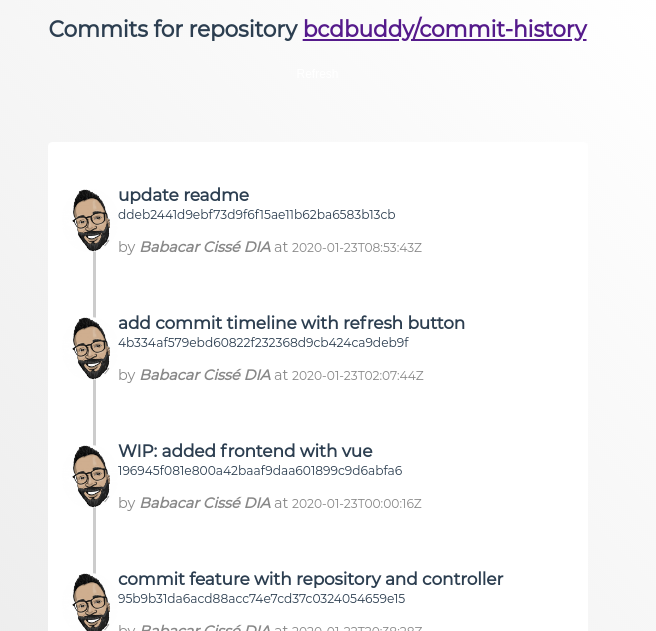
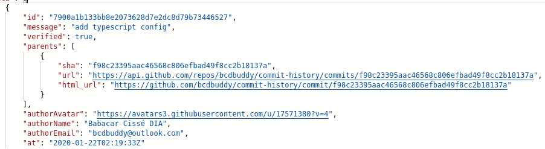

# _Commit History_
This is a sample project retrieving commits from a repository (this very one! Yes recursive, right!) for a specific repository and displaying in with light frontend (here Vuejs)


# Objectives:
- build REST API that allows to read commits
- consume GitHub API from NodeJS
- refresh action (front end)
references: https://developer.github.com/v3/

# Front end
Implemented with vuejs [available here](./frontend/README.md)

<!-- deployed at https://commit-history-frontend.herokuapp.com -->

# Back end
Implemented with expressjs with typescript [available here](./backend/README.md)
`GET /commit`
<!-- deployed at https://commit-history-backend.herokuapp.com -->


# Installation

```bash
  git clone git@github.com:bcdbuddy/commit-history.git
  
  # Front end
  cd frontend
  yarn install
  cp sample.env .env
  yarn serve

  # Back end
  cd backend
  yarn install
  cp sample.env .env
  yarn watch
```

# TODO
- test
- change repository parameter from .env to actual parameter
- add features:
  * compare commits
  * issues
  * pull requests associated with a commit
  * branches
- support other repository (gitlab, bitbuckets)